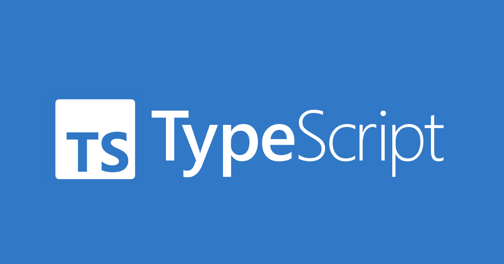

# Hello Guys ! In this tutorial I'm going to explain typescript

first of all you should know what is typescript(ts).

# What is Typescript?

Typescript is a superset of Javascript that adds static typing and other features on top of JavaScript.

Typescript (TS) is a programming language developed and maintained by Microsoft. It offers static type checking
It's developed by Microsoft, which means it has the backing from one of the biggest companies in software
development worldwide - Google!

TypeScript offers several benefits over plain old JavaScript:
1- Static Typing : TypeScript enforces type checking at compile time so any mistakes can
be caught before they become runtime errors or bugs.

2- Intelligent Autocompletion : With intelligent auto completion tools like Visual Studio Code’s
IntelliSense feature,
developers don't have to waste their valuable time looking up documentation for functions

3- Better Refactorability : Since code written using TypeScript is already well structured with classes
and interfaces

# Why to learn Typescript ?
 
 1. Type Safety
 2. Code Maintainability
 3. Tooling Support
 4. Refactoring and Scalability
 5. Strong Community and Support

 # How to run typescript ?

 You have to download nodejs in your machine. IF you haven't then download from here. https://nodejs.org/en/download
