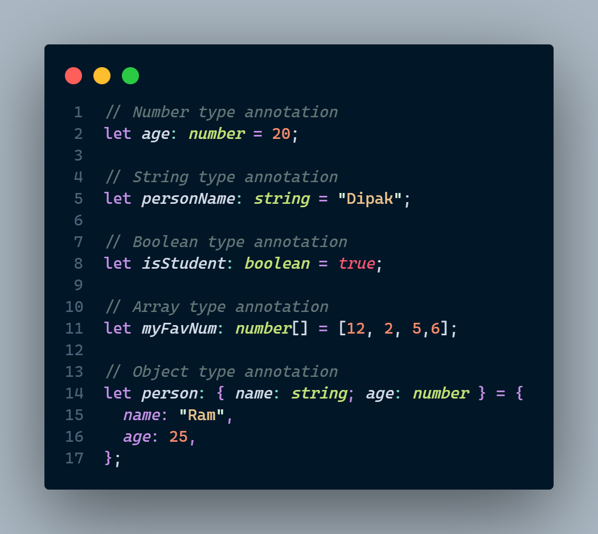
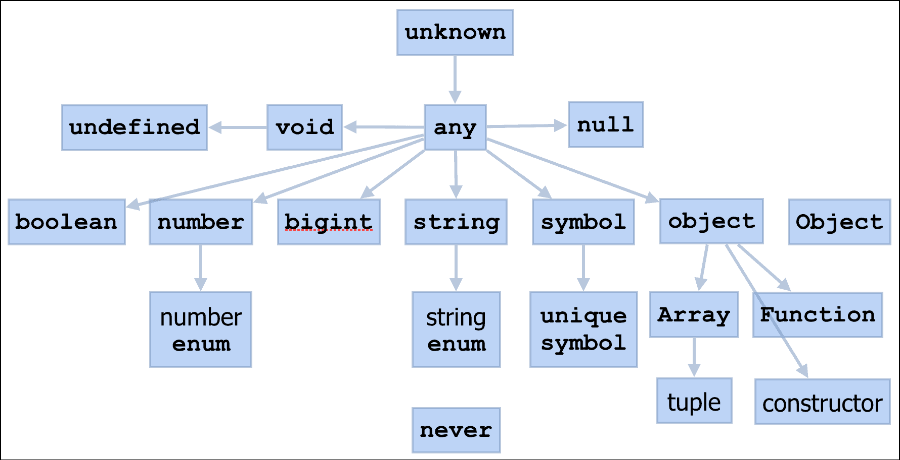

# Hello Guys ! In this tutorial I'm going to explain typescript

first of all you should know what is typescript(ts).

# What is Typescript?

Typescript is a superset of Javascript that adds static typing and other features on top of JavaScript.

Typescript (TS) is a programming language developed and maintained by Microsoft. It offers static type checking
It's developed by Microsoft, which means it has the backing from one of the biggest companies in software
development worldwide - Google!

TypeScript offers several benefits over plain old JavaScript:
1- Static Typing : TypeScript enforces type checking at compile time so any mistakes can
be caught before they become runtime errors or bugs.

2- Intelligent Autocompletion : With intelligent auto completion tools like Visual Studio Code’s
IntelliSense feature,
developers don't have to waste their valuable time looking up documentation for functions

3- Better Refactorability : Since code written using TypeScript is already well structured with classes
and interfaces

# Why to learn Typescript ?

1.  Type Safety
2.  Code Maintainability
3.  Tooling Support
4.  Refactoring and Scalability
5.  Strong Community and Support

# How to run typescript ?

You have to download nodejs in your machine. IF you haven't then download from here. https://nodejs.org/en/download
You have also install npm || yarn in your local machine
After that in your terminal install typescript globally
`npm install -g typescript`

`tsc --init`

or if you are using **yarn** then
`yarn add -g typescript`

`npx tsc --init`

This command will create tsconfig file where we configure our project settings
such as compiler options, files included/excluded etc..

In tsconfig.json file have enable this content

```
"compilerOptions": {
    "target":"es6",
    "module": "commonjs",
    "rootDir":".src/app.ts"
    "outDir": "./dist/",
    "strict": true,
    "sourceMap":true,
    "noEmitOnError":true,
    "removeComments": true,
    "forceConsistentCasingInFileNames": true,
    "noUnusedLocals": true,
    "noUnusedParameters": true,
    "noImplicitReturns": true,
    "esModuleInterop": true,
}

```

Then create directory name `src` in that create app.ts file

# Our first program on typescript

let's write code on `app.ts file(src/app.ts)`

```
    let name:string = "Hello World"
    console.log(string)
```

save the file and go to the terminal hit the `tsc` command to compiler the .ts file to .js file
and run the app `node dist/app.js` then you'll see output


# congratulations buddie `now you are typescript programmer 😄`

# Next. What is type annotations in typescript ?

Type annotations in TypeScript are used to explicitly specify the types of variables, function parameters, return values, and other elements in your code.

**for example**




if we try to write other it throw the error
**because we must keep add value or change value according to the that variable annotations**
```
// Number type annotation
let age: number = 20;
age = "dipak"

// String type annotation
let personName: string = "Dipak";
personName = [2,4]

// Boolean type annotation
let isStudent: boolean = true;
isStudent = "true"
// Array type annotation
let myFavNum: number[] = [12, 2, 5,6];

myFavNum = "hello"

// Object type annotation
let person: { name: string; age: number } = {
  name: "Ram",
  age: 25,
};
```

## #Type Inference
Type inference works by analyzing how variables are initialized and used throughout the code, and based on that analysis, it assigns appropriate types to those variables. This helps reduce the need for explicit type annotations, making the code more concise and readable while still providing static type checking.

```
let message = "Hello, TypeScript"; // The compiler infers the type of 'message' as 'string'
let count = 42;                    // The compiler infers the type of 'count' as 'number'
let isValid = true;                // The compiler infers the type of 'isValid' as 'boolean'

```


# Primitive data types in Typescript ?
TypeScript supports primitives, which are the basic types in JavaScript that make up data other than functions and objects.
More you understand below images




# Now we'll understand about an Array with typescript. 

An array is a special type of data type which can store multiple values of different data types sequentially using a special syntax.

TypeScript supports arrays, similar to JavaScript. There are two ways to declare an array:

1. Using square brackets. This method is similar to how you would declare arrays in JavaScript.
```
let friends: string[] = ['Ram', 'Sita', 'Hanuman'];
```

2. Using a generic array type, Array<elementType>.

let Friends: Array<string> =['Ram', 'Sita', 'Hanuman'];

```
// Multi type array

let person: Array<string | number> = ['DIPAK',20,'NEPAL','PROGRAMMER',50];


console.log(`My name is ${person[0]} and my age is ${person[1]} and I'm from ${person[2]}. I'm a ${person[3]}, I have a more than ${person[4]} projects`)
```


## Union Type in typescript

Union types in TypeScript allow you to specify that a variable or parameter can hold values of different types. This is useful when you want a variable to be able to accept multiple types while still benefiting from TypeScript's static type checking.

```
// Union type: a variable that can hold values of type 'number' or 'string'
let ageOrName: number | string;

ageOrName = 25;     // Valid, as 'ageOrName' can hold a number
ageOrName = "RAM"; // Valid, as 'ageOrName' can hold a string
// ageOrName = true; // Error, as 'ageOrName' can only hold a number or a string

```

Union types are beneficial in scenarios where a single variable can accept different types of values based on some condition or input. For instance, you can use union types in function parameters to accept different argument types:

```
function printID(id: number | string) {
  console.log(`ID: ${id}`);
}

printID(42);       // Valid
printID("ABC123"); // Valid
// printID(true);  // Error, as 'id' should be a number or a string

```


### Intersection type in Typescript
In addition to the | symbol, you can use & to create intersection types where a variable must satisfy multiple type conditions.
type A = { foo: number };
type B = { bar: string };

// Intersection type: a variable must satisfy both type A and type B
let combined: A & B = { foo: 42, bar: "hello" };


## Type Assertion(Type cast)
Type assertions, also known as type casts, are a way to tell the TypeScript compiler that you know more about the type of a value than its. It allows you to explicitly specify the type of a variable or expression, overriding the compiler's type inference. Type assertions are written using either the as keyword or the angle bracket syntax (<>).

Type assertions are useful in situations where you have more information about the type of a value than TypeScript can infer, or when you want to work with a value as a specific type temporarily. It's important to note that type assertions do not perform any runtime checks or conversions. They only affect how the TypeScript compiler treats the types during static type checking.

**Using the as keyword:**
```
let someValue: any = "this is a string";

// Type assertion: Treat 'someValue' as a string
let strLength: number = (someValue as string).length;

// Type assertion with union type: Treat 'someValue' as a number or a string
let strOrNum: string | number = someValue as string | number;

```

Using the **angle<>** bracket syntax:

```
let someValue: any = "this is a string";

// Type assertion: Treat 'someValue' as a string
let strLength: number = (<string>someValue).length;

// Type assertion with union type: Treat 'someValue' as a number or a string
let strOrNum: string | number = <string | number>someValue;

```


## Literal Type in typescript ?


In TypeScript, literal types allow you to specify exact values that a variable or parameter can hold. Literal types are a subset of TypeScript's type system that define specific, concrete values for variables, function parameters, and object properties. Using literal types can make your code more expressive and help catch bugs early by restricting the allowed values to a specific set.

1. String Literal Types:
A string literal type represents a specific string value. It is denoted by enclosing the string value in single or double quotes.
```
let color: "red" = "red";
// color = "blue"; // Error, as 'color' can only be "red"

```
2.Numeric Literal Types:
A numeric literal type represents a specific numeric value. It is denoted by writing the numeric value directly.

```
let statusCode: 200 = 200;
// statusCode = 404; // Error, as 'statusCode' can only be 200
```


3. Enum Member Literal Types:
Enum member literal types allow you to use specific values from an enum as literal types.
```
enum Direction {
  Up = "UP",
  Down = "DOWN",
  Left = "LEFT",
  Right = "RIGHT",
}

function move(direction: Direction) {
  // Function logic here
}

move(Direction.Up);   // Valid
move(Direction.Down); // Valid
// move("LEFT");       // Error, as the argument must be of type Direction enum

```


There are several types of literal. You can explore in to the internet


## Object (most used) in typescript 
In TypeScript, an object is a data type that represents a collection of key-value pairs, where each key is a string (or symbol) and each value can be of any data type. Objects are fundamental in JavaScript and are used to store and manipulate data in a structured manner.

In TypeScript, you can define an object's shape using an interface or a type alias. Here's how you can create and work with objects in TypeScript:

1. Declaring an object with a specific shape using interfaces:
```
interface Person {
  name: string;
  age: number;
  email: string;
}

const person: Person = {
  name: "ram",
  age: 30,
  email: "ram@example.com",
};

```

2.Declaring an object with a specific shape using type aliases:
```
type Car = {
  make: string;
  model: string;
  year: number;
};

const car: Car = {
  make: "Toyota",
  model: "Corolla",
  year: 2020,
};

```


## Typescript Tuples

TypeScript introduced a new data type called Tuple. Tuple can contain two values of different data types.

for Example
```
let employee: [number, string] = [1, "Ram"];
let person: [number, string, boolean] = [1, "Ram", true];

let user: [number, string, boolean, number, string];// declare tuple variable
user = [1, "Ram", true, 20, "Admin"];// initialize tuple variable
```

**Tuple in array
```
let employee: [number, string][];
employee = [[1, "Steve"], [2, "Bill"], [3, "Jeff"]];
```


## Function in typescript 

Functions are the basic building block of any application, whether they’re local functions, imported from another module, or methods on a class. They’re also values, and just like other values, TypeScript has many ways to describe how functions can be called. Let’s learn about how to write types that describe functions.

**Function Type Expressions**
The simplest way to describe a function is with a function type expression. These types are syntactically similar to arrow functions:


```
function name(fn: (a: string) => void) {
  fn("Namaste, Ram");
}
 
function printName(s: string) {
  console.log(s);
}
 
greeter(printName);
```


## Type Aliases in typescript 


In TypeScript, type aliases allow you to create custom names for any type. This is especially useful when you have complex or repetitive types that you want to refer to by a simpler, more descriptive name. Type aliases do not introduce new types; they merely create a new name for an existing type.

To define a type alias, you use the type keyword followed by the alias name and the corresponding type. Here's the general syntax:

**type AliasName = TypeDefinition;**

```
// Basic Type aliases
type ID = number;

const userId: ID = 123;

```

**Union Type aliases**
```
type Status = "pending" | "approved" | "rejected";

function processStatus(status: Status): void {
  // implementation
}

processStatus("pending"); // Valid
processStatus("approved"); // Valid
processStatus("invalid"); // Error - Type '"invalid"' is not assignable to type 'Status'.

```

**Object Type aliases**

```
type Point = {
  x: number;
  y: number;
};

function printCoordinates(point: Point): void {
  console.log(`x: ${point.x}, y: ${point.y}`);
}

const myPoint: Point = { x: 10, y: 20 };
printCoordinates(myPoint); // Output: x: 10, y: 20

```


## Most Important Topic is Interface

In TypeScript, an interface is a powerful construct that allows you to define the shape or structure of an object. It provides a way to describe the properties and their types that an object should have, without necessarily implementing the actual behavior. Interfaces are used for type-checking during development to ensure that objects adhere to the defined structure.

To define an interface in TypeScript, you use the `interface` keyword followed by the interface name and the properties it should have
`Here's the basic syntax:`

```
interface MyInterface {
  prop1: type1;
  prop2: type2;
  // ... more properties
}

```

```
interface User {
  id: number;
  name: string;
  age: number;
  email: string;
}
const user1: User = {
  id: 1,
  name: "ram",
  age: 30,
  email: "ram@example.com",
};

const user2: User = {
  id: 2,
  name: "Jane Smith",
  age: 25,
  email: "jane@example.com",
};

// Error: Missing 'email' property
const user3: User = {
  id: 3,
  name: "Bob ramson",
  age: 40,
};

```